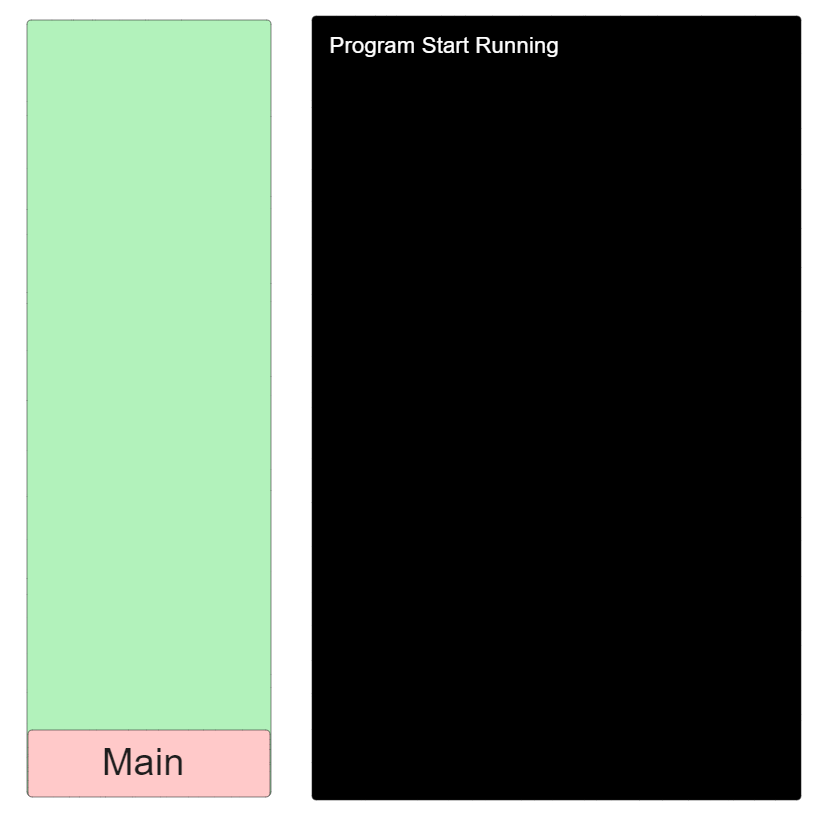
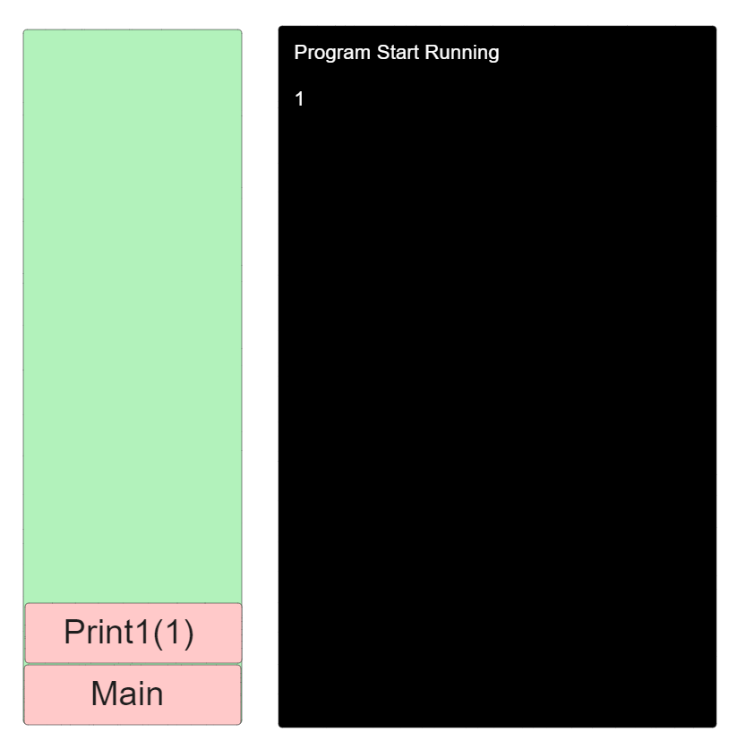
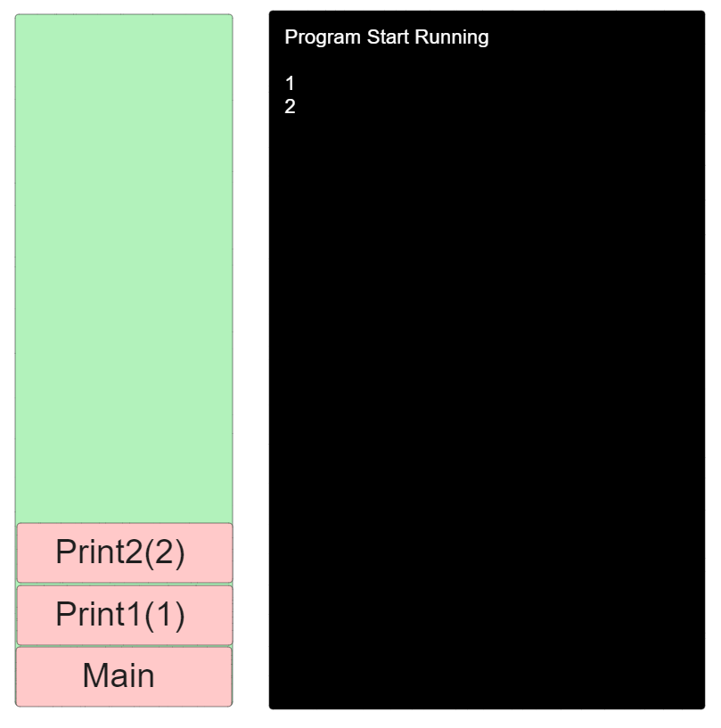
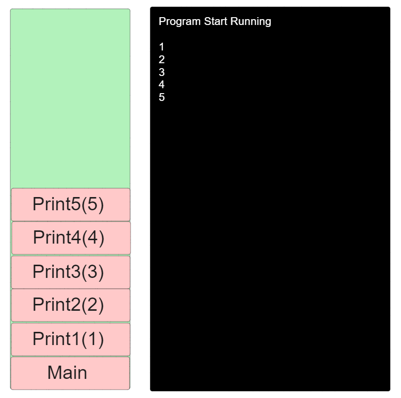
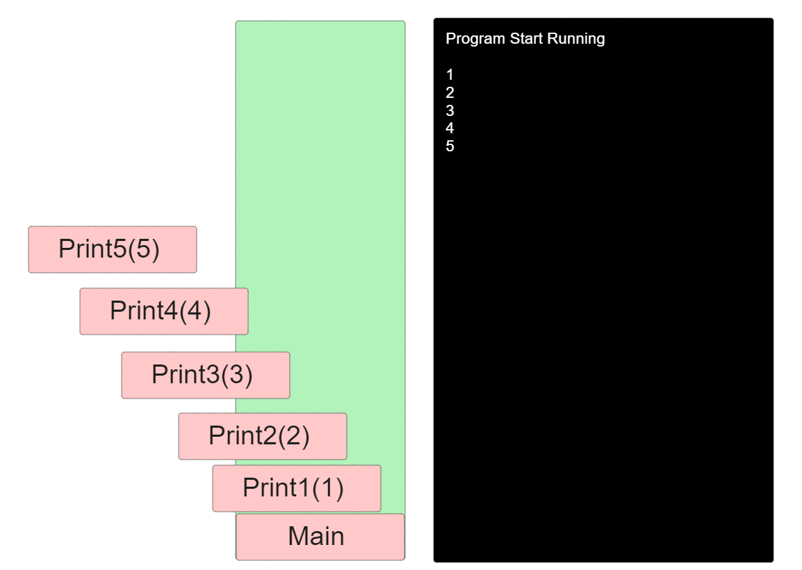
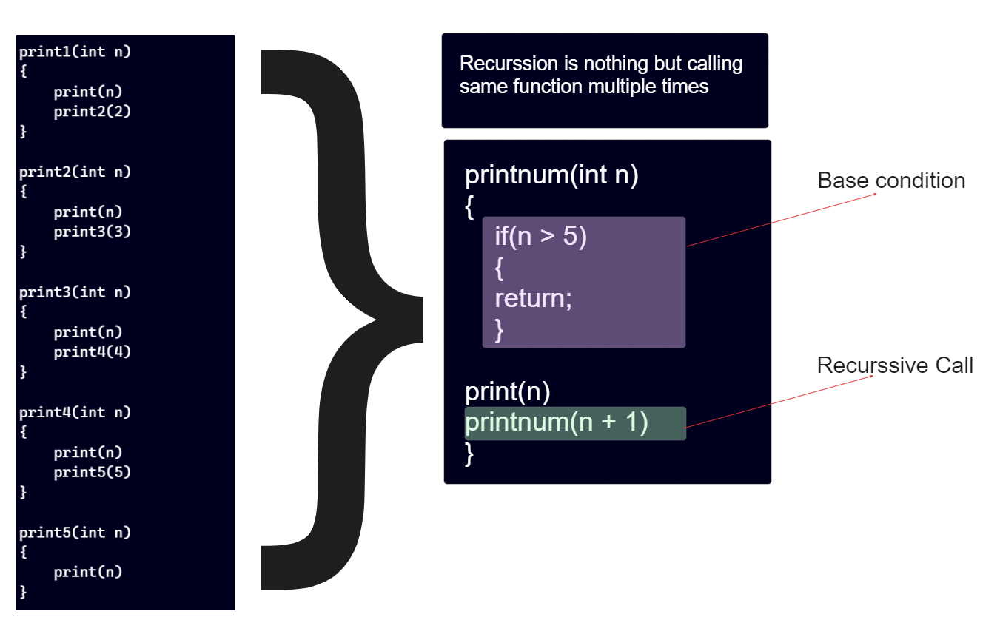
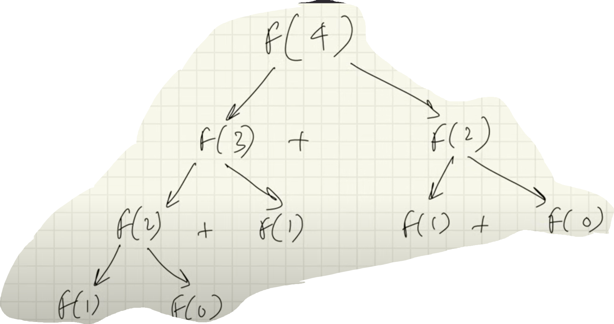
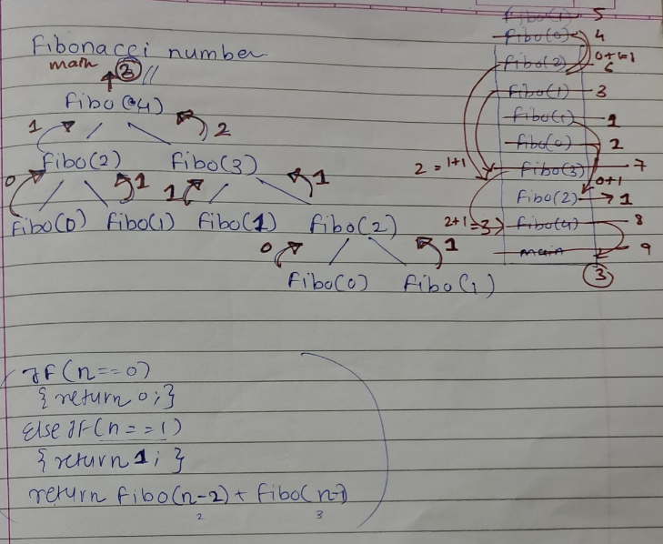
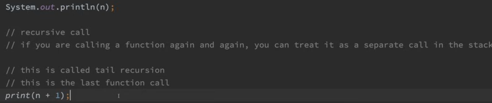

# Day_16 Recursion

<h3>Recursion is defined as a process which calls itself directly or indirectly and the corresponding function is called a recursive function.</h3>

<h2>Introduction to Recurssion</h2>

```
print the "Hello World!" String 5 times
```

<h3> Now here we cannot use print function 5 times to print the string "Hello World!" and also cannot use 5 times function call of same or different function in main function</h3>

```
main ()
{
    message();
}

message()
{
    print("Hello World!")
    message1()
}

message1()
{
    print("Hello World!")
    message2()
}

message2()
{
    print("Hello World!")
    message3()
}

message3()
{
    print("Hello World!")
    message4()
}

message4()
{
    print("Hello World!")
}

```

<h3>Second Example</h3>

```
print the number from 1 to 5 using multiple function call of different functions
```

<h3>Here we can create multiple functions which are printing numbers starting from 1 till 5 so we require 5 functions for this which having same body and definition but created differently</h3>

```
main()
{
    print1(1)
}

print1(int n)
{
    print(n)
    print2(2)
}

print2(int n)
{
    print(n)
    print3(3)
}

print3(int n)
{
    print(n)
    print4(4)
}

print4(int n)
{
    print(n)
    print5(5)
}

print5(int n)
{
    print(n)
}

```







<h3>Lets introduce recurssion here </h3>



<h3>When we are using recurssion then we are using the operating system stack extensively so when their is very high looping means large number of function calls then recurssion put it's knee down🧎‍➡️🧎‍➡️ due to stackoverflow error</h3>

<h2>Why Recurssion call 🤔</h2>
<ol>
<li>It help us to solve complex problems in simple way</li>
<li>We convert convert recussion solution into iteration to make it more optimised</li>
<li>Space complexity it is not constant because of recurssive calls</li>
</ol>

<h2>Visulaising Recurssion 😎</h2>
<h3>To visualise the recurssive solution we use recurssion tree</h3>
 
<h2>How to figure out when to use recurssion</h2>
<h3>Practice 😁</h3>
<h3>If their is a small version of problem we can solve E.g <mark>In nth fibonacci number finding program we know that the nth fibonacci is equal to <b>fibonacci of (n-2) + fibonacci of (n-1)</b> </mark></h3>



<h2>Recurence Relation 🟰➕➖➗✖️</h2>
<h3>When we convert the recurssion into a equation/relation then that relation is called as recurrence relation</h3>

<h3><mark>fibo(n) = fibo(n-2) + fibo(n-1)</mark></h3>
<h3>If any problem is break down in smaller problem then we can solve that problem using recurssion</h3>



<h2>Tail Recurssion </h2>
<h3>Tail recurssion is nothing but the last function call</h3>

<h3>Tail Recurssion</h3>



<h3>Not a Tail Recurssion</h3>


<h2>How to understand and approach a recurssion problem ⚙️</h2>
<ul>
<li>Indentify if you can breakdown the problem into smaller problems</li>
<li>Write the recurrence relation if needed</li>
<li>Draw the recurssion tree</li>
</ul>

<h3>About the recurssion tree</h3>
<ul>
<li>See the flow of the functions how they are getting in stack</li>
<li>Identify & focus on left tree calls and right tree calls. Like first all left nodes are execute and after that right node execute and at last middle one</li>
</ul>

<h3>Draw recurssion tree on the paper and pointing each step perform dry run</h3>
<h3>See how the values are return at each step and where the function call come out</h3>
