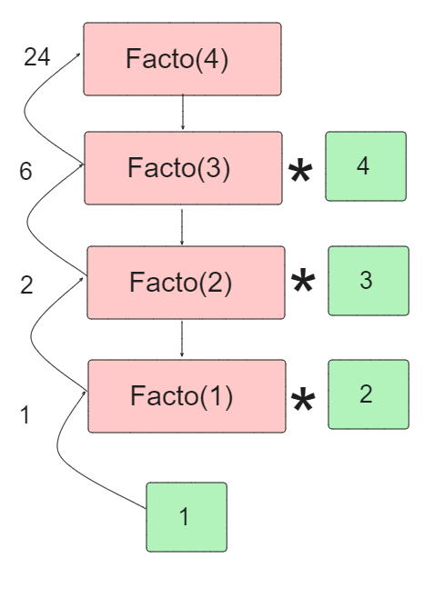
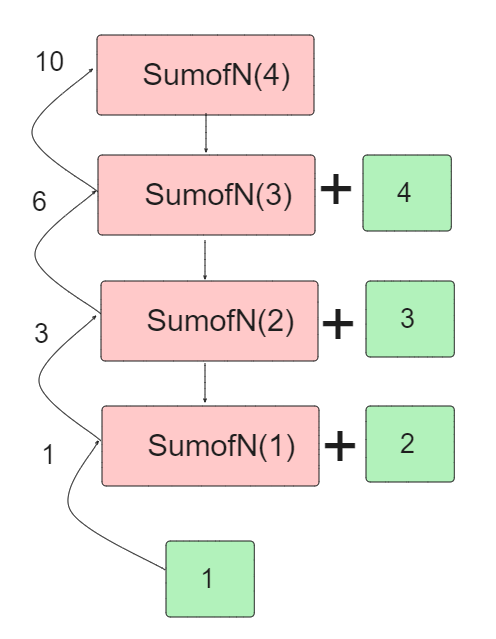
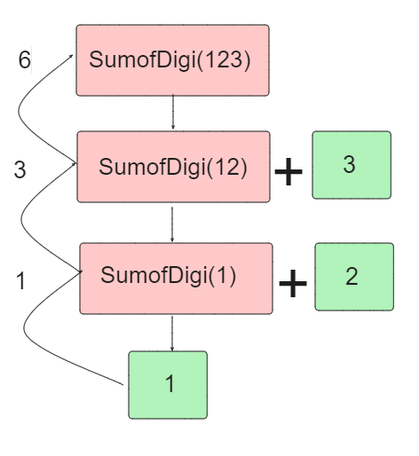

# Recurssion Questions1

<h2>Print the number from n to 1 using recurssion</h2>

```
printNum(int n)
{
    if( n < 1 )
    {
        return;
    }
    print(n);
    printNum(n-1);
}
```

<h2>Factorial of n</h2>

```
facto(n)
{
    if(n<=1)
    {
        return 1;
    }
    return facto(n-1)*n;
}
```



<h2>Sum of N digit</h2>

```
SumofN(n)
{
    if(n<=1)
    {
        return n;
    }
    return SumofN(n-1)+n;
}
```



<h2>Sum of digits</h2>

```
sumofDigit(int n)
{
    if(n<=1)
    {
        return 0;
    }
    return sumofDigit(n/10) * n%10;
}
```



<h2>Reverse the number</h2>
<h3>Input : 123</h3>
<h3>Output : 321</h3>

```
int revNum(int n,int res)
    {
        if(n==0)
        {
            return res;
        }
        res=(res*10)+(n%10);
        return revNum(n/10,res);

    }
```
